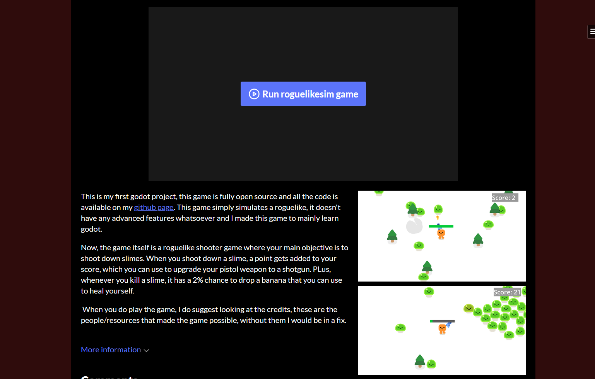

# Roguelike Simulator 

This is my first godot project made for Horizons. This is a simple roguelike simulator type game where the player has to kill slimes to earn points, eat bananas and buy upgrades with those points in the shop. The only available gun right now are the pistol (which is free) and the shotgun (which costs 300 points). This project also contains a full main menu which allows you to see the credits, audio options, shop, play game and allows you to quit the game too. This project was made for me to learn godot and learn how to submit my own projects so I could be ready for game jams in the future. Hence, this project has heavily relied on premade assets and tutorials.

This project was made fully in Godot 4.7.1 stable.


## How to play the game

There are 2 ways to play the game, on is to play it on the web with itch.io and the other is to play it on godot itself. I recommend playing it on itch.io as it saves the hassle to install and run all the components on your computer.

### Itch.io way

Press ([this link](https://notdoodlez.itch.io/roguelike-simulator)) to directly play my game, or copy and paste this link into your browser to play the game ->   https://notdoodlez.itch.io/roguelike-simulator




### Godot Installation way

1. Go to the top of this repository and click on code and copy the link shown for https


If you already have git, then the next step is to go into ur cmd and type out
```sh
git clone https://notdoodlez.itch.io/roguelike-simulator
```


But don't worry, if you dont know how to use git or are scared of cmd, then just use the github desktop app.

1. Go to your github desktop app, click file on the top left corner and then click clone respository


2. Finally, press URL at the top and paste the link you copied in github to the app. Then select the folder you want to save it to and finally press clone.


## AI use

This project does not contain any part that is created by generative AI according to my knowledge. All code is either made by NotDoodlez, Poldotts, Online tutorials, godot documentation or people on the internet who had the same problem as me.

## Conclusion

Thank you for visiting my page and reading this all the way through, and if any of this piques your interest please do pay a visit to my game on itch.io. 